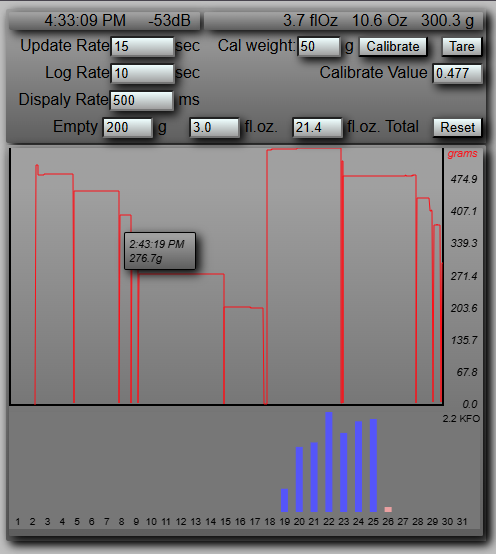

# SmartCoaster
WiFi Scale that measures water consumption  
  
A really small scale using common parts  
  
HX711  
47mm load cell  
ESP32-C3-supermini  
  
[3D parts on Thingiverse](https://www.thingiverse.com/thing:7047511)  
  
For initialization, place an accurate weight on the scale, enter the weight in the Cal weight value (grams), press "Calibrate" then remove and then press "Tare" to zero it. Then check it again. If that fails, enter a Calibrate value and press enter to change it. Lower value increases. Using this code as a normal scale isn't recommended as it has a long settle delay (2 seconds+), but would be accurate.  

Adding a "pause" button to stop water checking and skipping settle can be a future idea.  
  
  

